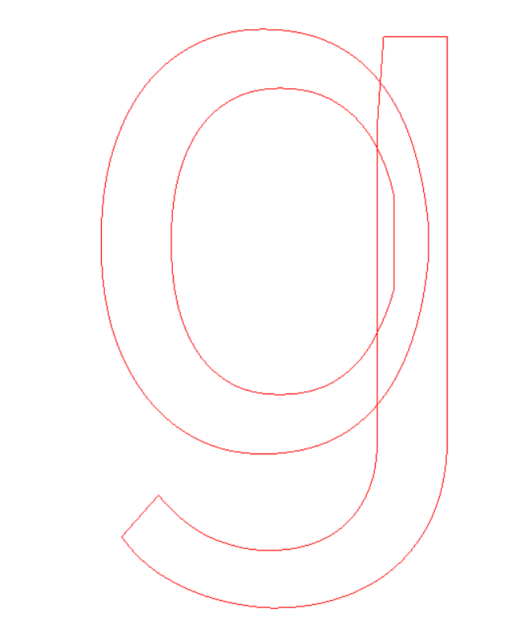
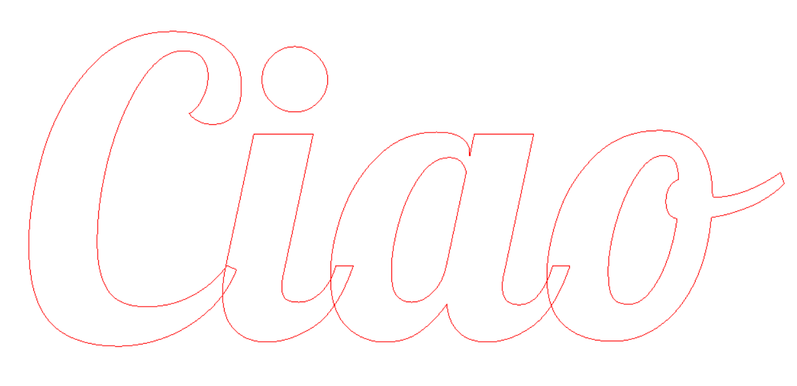
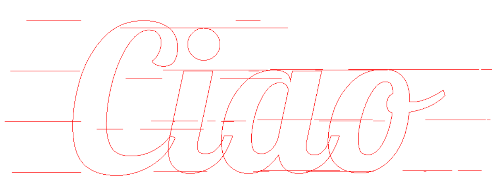

## Introduzione

Il presente progetto prevede l'implementazione di un'applicazione che dato in input un font, la dimensione del font, il raggio di una fresa genera in output un file o una finestra di rendering per mostrare i path della fresa.

## Compilare il codice

Il progetto è stato creato con l'ausilio del CMake, per poterlo eseguire è necessario:

1. creare una directory build
2. cd build
3. cmake ..

oppure se si utilizza il cmake-gui si imposta la directory del codice sorgente, la directory devo verranno creati i file binari ed in seguito premere il tasto Configure. Selezionare il tipo di "generatore" desiderato, nei test svolti è "Visual Studio 17 2022" e premere il tasto Finish. Premere  una seconda volta configure ed infine il tasto generate. All'interno della directory selezionata per i file binari sarà creata la solution (file .sln) del progetto, aprirla e compilare in Release. I file binari prodotti dalla compilazione saranno messi nella directory bin. 

## Eseguire L'applicazione

L'applicazione prende in input tre parametri:
1. Il /path/to/font/Font.ttf 
2. La dimensione del raggio
3. Lo spacing tra una scanline e l'altra
4. La dimensione del font
5. Il testo da utilizzare es: Kosmosoft
   - per usare testo composto da più parole racchiuderle tra doppi apici: "Hello World"

L' applicazione crea un file output.dxf.

## Known issues

1. Il font Roboto definisce un carattere con una serie di poligoni che possono sovrapporsi gli uni agli altri. Un esempio è la figura mostrata in seguito: 
In questo caso i bordi interni (holes) e dei bordi esterni implementata non riesce ad individuarli opportunamente. Per ovviare a tale problema si potrebbero utilizzare operazioni booleane per rimuovere parti di poligono contenute in un altro e poi di merge dei segmenti.

2. Per font come Lobster in cui le lettere si sovrappongono le une alle altre si presenta un problema analogo al punto 1. Un esempio è mostrato in figura:  

3. per valori di raggio troppo grandi le scan line non vengono calcolate correttamente 

4. *sharp edges* questi potrebbero portare a problemi per il calcolo delle normali e quindi dell'offset dal bordo. 
## Miglioramenti

1. Aggiungere il supporto per altri tipi di font, per ora supportato tff;
2. Aggiungere vec2 e point mediante template così da poter gestire punti interi, double, ecc. Ed implementare operazioni su vec2 e point come funzioni delle rispettive classi;
3. Dare l' opportunità di convertire tutte le misure in mm o inches;
4. Gestire in modo opportuno il raggio e lo spacing al fine di poter suggerire all'utente che raggio utilizzare in base al font e alla dimensione;
5. Integrare il presente esempio in una GUI con rendering dei segmenti;
6. Utilizzare strutture dati spaziali (e.g. R-Tree) per ridurre il numero di segmenti analizzati per individuare le intersezioni.